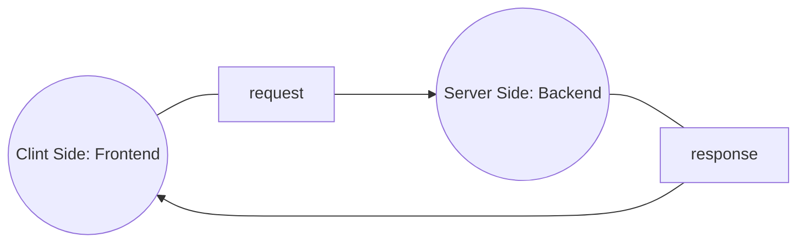
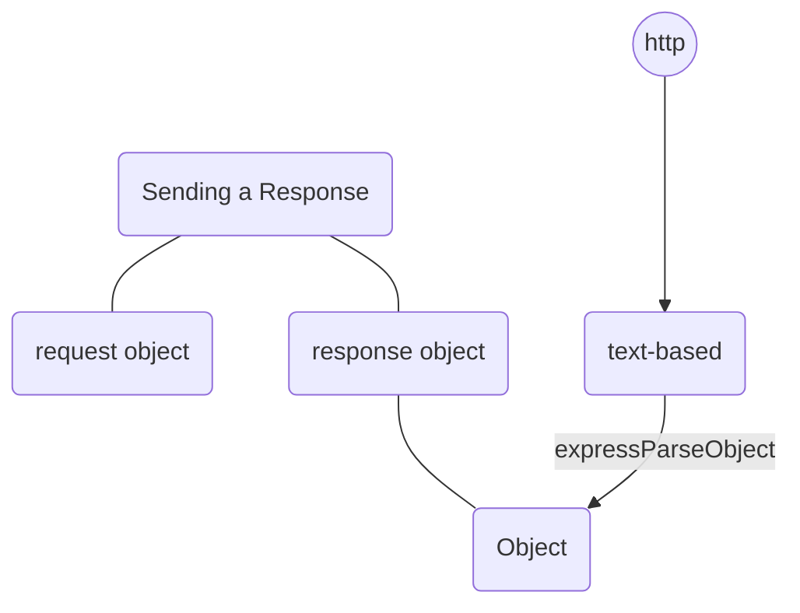
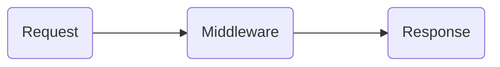

# Express.js
Chapters:
1. Library v/s Framework
1. What is Express.js
1. Before Express.js
1. First Express App
1. Basic Routing
1. Advance Routing
1. Req and Res Advance Topics
1. Postman and App.route()
1. Advance Router
1. Route Parameters In Depth
1. Controllers In Depth
1. Query String In Depth
1. Sending JSON
1. Express Middleware's In Depth
1. Serving Static Files In Express
1. Template Engine Setup
1. EJS Crash Course


### 1. Library v/s Framework
#### Library
- A library is a collection of pre-written code that can be used to perform specific task. Eg: axios

#### Framework
- A framework is a set of pre-written code that provides a structure for developing software applications. Eg: express

### 2. What is Express.js?
- A Node.js web application framework that helps us to make web applications
- It is used for server side programming.



#### Express 4 Major usage
1. listen for incoming request like GET,POST
1. parse
1. to match response with routes
1. response

### 3. Getting Started with express
```
npm init -y
npm install express
```
- to initialize node and install express
- touch index.js or create index.js file

```javascript
const express = require("express");

const app = express();
```
- to use express

#### express app object
```javascript
const express = require("express")

const app = express();
console.dir(app)
```
- by printing console.dir(app)
- you can get the object

#### app.listen method
- listen make web server which handles incoming api request
```javascript
const express = require("express")
const app = express();


const PORT = 3000;
app.listen(PORT, ()=>{
    console.log(`app listening on port ${PORT}`);
})
```
- **PORT** are the logical endpoints of a network connection that is used to exchange information between a web server and web clint.

#### app.use
- it handles all types of request like: get, post
```javascript
app.use((req, res) => {
    console.log("request received");

})
```


#### request and response
```javascript
app.use((req, res) => {
    // console.log(req);
    console.log("request received");
    // res.send("this is a basic response")

    // object response
    res.send({
        name:"apple",
        color:"red"
    })

    // html response
    res.send(`
            <h1>Fruits</h1>
            <ul>
                <li>apple</li>
                <li>orange</li>
            </ul>
        `)
})
```

### Routing
- Routing is process of selecting a path for traffic in a network or between or across multiple networks.

```javascript
app.get("/", (req, res) => {
    res.send("you contacted root path")
})
app.get("/apple", (req, res) => {
    res.send("you contacted apple path")
})
app.get("/orange", (req, res) => {
    res.send("you contacted orange path")
})

app.post("/", (req, res) => {
    res.send("you send a post request to root ")
})

app.get("*", (req, res) => {
    res.send("this path does not exist")
})
```
#### install Nodemon
- To automatically restart server with code change

### Path Parameters
```javascript
// path parameter
app.get("/:username/:id", (req, res) => {
    let { username, id } = req.params
    console.log(req.params);

    res.send(`Username:${username} id:${id}`)
})
```

### Query String
```javascript
app.get("/search", (req, res) => {
    console.log(req.query);
    let { q } = req.query
    res.send(`Success query is ${q}`)

})

// search query
// http://localhost:8000/search?q=apple
// response
// Success query is apple
```

### Template Engine Setup
- EJS (Embedded Javascript template)
- EJS is a simple templating language that lets you generate HTML markup with plan javascript  

#### Template setup
``
npm int -y
``
``
npm i express
``
- to install ejs
```
npm i ejs
```

- This is boilerplate code of express
```javascript
const express = require("express")
const app = express()
const path = require("path")
const PORT = 8000

app.set("view engine", "ejs")
app.set("views", path.join(__dirname, 'views'))

app.get("/", (req, res) => {
    res.render("home.ejs")
})

app.listen(PORT, () => {
    console.log(`listening on port ${PORT}`);

})

```
- ejs code implementation
```javascript
const path = require("path")

app.set("view engine", "ejs")
app.set("views", path.join(__dirname, 'views'))

app.get("/", (req, res) => {
    res.render("home.ejs")
})
```
1. st step: set view engine to ejs
1. create view folder and file with .ejs extension
1. set path to tell express view file name or search file name in views folder
1. res.render("filename") it can work without .ejs extension also

#### Interpolation Syntax
- Interpolation refers to **embedded expression** into marked up text.
- ejs is used to dynamic html code

#### EJS Printing variable

```javascript
<%= username %>
```
- between these `<%=` js code `%>` we can write javascripe

#### conditional statements in EJS
```ejs
<% if(age >= 18){ %>
<h2>You can vote</h2>
<% }%>
```
#### looping ejs
```javascript
app.get("/ig/:username", (req, res) => {
    const followers = ["adam", "bob", "steve", "john"]
    let { username } = req.params
    res.render("instagram.ejs", { username, followers })

})

 <% for(let name of followers) { %>
            <li>
                <%= name %>
            </li>
            <% } %>
```
#### Includes
```ejs
<%- include("includes/head.ejs") %>
```

### REST
- Representational State Transfer
- REST ia an architecture style that defines a set of constraints to be used for creating web services.

#### RESTfull APIs
- REST full apis are the type of apis which use rest architecture  style to build apis
- REST full apis are used to perform CRUD operations

#### CRUD Operations
- **GET** retrieves resources.
- **POST** submits new data to the server
- **PUT** updates existing data
- **PATCH** update existing data partially
- **DELETE** removes data

#### Creating RESTful APIs
|||||
|---|---|---|---|
|GET|/posts|to get data for all posts|VIEW INDEX(main)|
|POST|/posts|to add a new post|CREATE|
|GET|/posts/:id|to get one post (user id)|VIEW|
|PATCH|/posts/:id|to update specific post|UPDATE|
|DELETE|/posts/:id|to delete specific post|DESTROY|

#### Project setup
```
npm init -y
npm i express
npm i ejs

or 
npm i express ejs
```
- create views folder, create index.js file, and pest the code
```javascript
const express = require("express")
const app = express()
const PORT = 8000


app.listen(PORT, () => {
    console.log(`listening on port ${PORT}`);

})
```
- then start the server
```
nodemon index.js
```
#### Create id for the posts
UUID Package
- Universally unique identifier
```
npm install uuid
```

### Middleware
- It is an intermediary

- **in Express**
- Middleware in Express are function that come into play after the server receives that request and before the response is sent to the clint.

#### Common middleware functions:
- methodOverride
- bodyParser
- express.static
- express.urlencoded